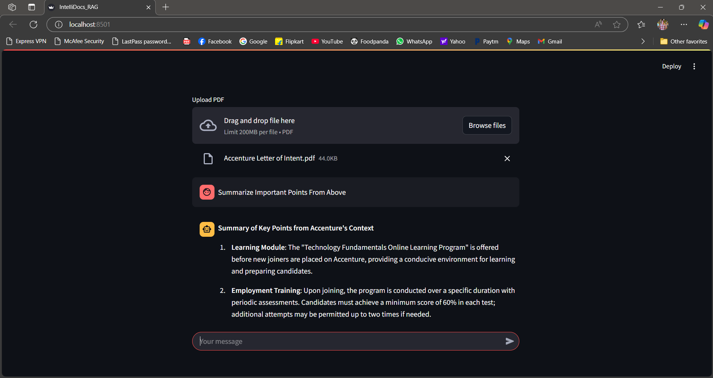

Here’s your updated README with an image section added for the screenshot:

---

# Intelligent Document Management and Query System

## Overview
This project implements a **Retrieval-Augmented Generation (RAG)** system for intelligent document management and query resolution. It is designed to extract relevant insights from documents using **DeepSeek R1: 1.5B** as the core language model.

## Features
- **Document Upload & Processing**: Users can upload PDFs which are then processed and indexed.
- **Chunking & Vectorization**: The text is split into manageable chunks and stored in an efficient vector database.
- **Semantic Search**: Users can input queries, and the system retrieves the most relevant document fragments.
- **Context-Aware Responses**: The retrieved context is used to generate accurate and concise answers.

## Optimization Goals
To make this project more research-paper oriented, the following enhancements will be implemented:
- **Domain-Specific Optimization**: Fine-tuning the RAG system for specific use cases (e.g., legal, healthcare, finance).
- **Efficiency Improvements**: Reducing retrieval latency and improving search accuracy.
- **Advanced Query Understanding**: Enhancing NLP capabilities to better interpret user intent.
- **Evaluation Metrics**: Defining and implementing robust performance benchmarks.

## How It Works
1. **Upload**: Users upload PDFs.
2. **Processing**: The text is extracted and chunked.
3. **Embedding**: Chunks are converted into vector embeddings.
4. **Storage**: The embeddings are stored in a vector database.
5. **Retrieval & Response**: User queries fetch relevant document sections, which are then used to generate responses.

## Technologies Used
- **DeepSeek R1: 1.5B** (Language Model)
- **FastAPI** (Backend API Framework)
- **LangChain** (RAG Implementation)
- **Vector Databases** (Efficient Storage & Retrieval)
- **Streamlit** (User Interface)

## Screenshot
  

## Next Steps
- Fine-tune retrieval parameters to optimize accuracy.
- Improve query handling for better contextual understanding.
- Expand dataset coverage for domain-specific testing.
- Prepare research paper detailing architecture, benchmarks, and optimizations.

---
