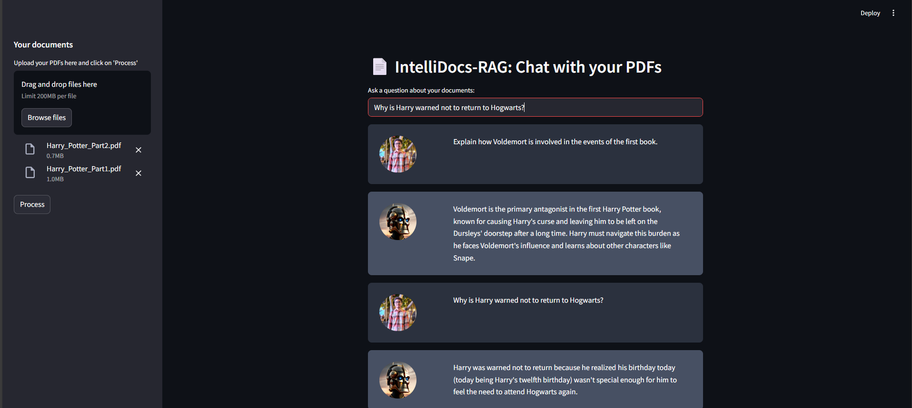

# 🤖 IntelliDocs-RAG: Local PDF Chatbot using RAG & Offline LLM



**IntelliDocs-RAG** is an intelligent chatbot system that lets users chat with their own PDF documents securely and privately — with **zero internet dependency**. Using a Retrieval-Augmented Generation (RAG) pipeline and a local LLM (via Ollama), the app provides fast, offline, and context-aware responses based on the content of multiple uploaded PDFs.

This project was developed as a **Final Year B.Tech Project** at the **National Institute of Technology, Kurukshetra (NIT Kurukshetra)**.

---

## 🎓 Project Team

- **Shakeeb Parwez**
- **Kushagra Agarwal**
- **Ayush Goyal**

**Guided by:** *Assistant Professor Dr. Sweeti Sah*

---

## 🧠 Real-World Use Case

> **Imagine a researcher working in a remote lab** with no internet access. They have a dozen PDF research papers on their topic and want quick answers without manually reading each one. Using **IntelliDocs-RAG**, they upload all PDFs and ask:
>  
> *"What are the key findings of paper 3?"*  
> *"Which papers discuss deep learning on time-series data?"*  
>  
> The system quickly returns accurate answers powered by a local LLM — no internet, no privacy concerns, and no hassle.

---

## 🔒 Why This Project Matters

Modern LLM apps often rely on cloud APIs (OpenAI, Google, Anthropic), making them:

- ❌ **Dependent on Internet Connectivity**
- ❌ **Risky for Confidential or Academic Documents**
- ❌ **Expensive with Limited API Quotas**

**IntelliDocs-RAG** solves this by offering:

✅ **Offline LLM Access via Ollama**  
✅ **Privacy-Focused Architecture** (local embeddings & vector search)  
✅ **Open-source & Customizable for Any Domain**

---

## 💻 Tech Stack — Powering IntelliDocs-RAG

| Component         | Tech Used                              | Purpose                                  |
|------------------|----------------------------------------|------------------------------------------|
| **Frontend**      | Streamlit                              | Interactive UI for uploading & chatting  |
| **PDF Parser**    | PyPDF2                                 | Text extraction from PDFs                |
| **Text Chunking** | LangChain CharacterTextSplitter        | Context preservation                     |
| **Embeddings**    | OllamaEmbeddings (`deepseek-r1:1.5b`)  | Semantic understanding                   |
| **Vector DB**     | FAISS                                  | Fast document similarity search          |
| **LLM Backend**   | Ollama + Local Model (`deepseek-r1`)   | Private, local response generation       |
| **Prompting**     | LangChain PromptTemplate               | Custom RAG-style Q&A prompt              |

---

## 🛠️ Installation & Setup

### 1. Clone the repository

```bash
git clone https://github.com/your-username/intellidocs-rag.git
cd intellidocs-rag
